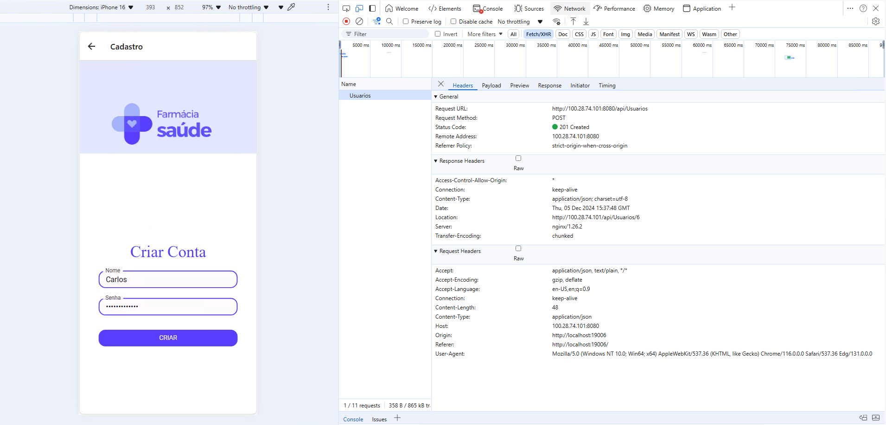
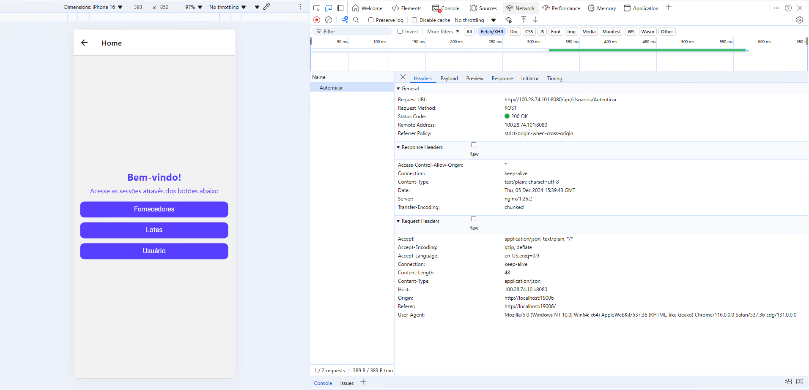

# Front-end Móvel

O front-end do sistema de controle de estoque de farmácias foi desenvolvido com React e Next.js para oferecer uma interface intuitiva e responsiva. Usando Material-UI e Emotion, o design é moderno e consistente, proporcionando uma experiência de uso prática para o gerenciamento de medicamentos e controle de estoque.

## Tecnologias Utilizadas
| Tecnologia    | Descrição                                                                  | Versão     |
|---------------|----------------------------------------------------------------------------|------------|
| Node.js e npm | Ambiente e gerenciador de pacotes e dependências do projeto.               | 18.3.1     |
| React         | Biblioteca JavaScript para construção de interfaces de usuário.            | 18.3.1     |
| Next.js       | Framework React para renderização do lado do servidor e sites estáticos.   | 14.2.16    |
| Material-UI   | Biblioteca de componentes React para interfaces de usuário.                | 6.1.3      |
| Emotion       | Biblioteca para estilização CSS-in-JS.                                     | 11.13.3    |
| Sass          | Pré-processador CSS que adiciona funcionalidades como variáveis e mixins.  | 1.79.4     |
| FontAwesome   | Biblioteca de ícones vetoriais e logotipos.                                | 6.6.0      |
| UUID          | Biblioteca para geração de identificadores únicos universais (UUIDs).      | 10.0.0     |
| Prettier      | Formatador de código.                                                      | 3.3.3      |
| ESLint        | Ferramenta de linting para identificar e corrigir problemas em JavaScript. | 8.57.1     |
| Typescript    | Superset de JavaScript que adiciona tipagem estática.                      | 5          |

## Arquitetura

A arquitetura da aplicação mobile segue o padrão de cliente-servidor, onde o front-end em React e Next.js interage com o back-end, que gerencia a lógica de negócios e persistência de dados. O front-end consome a API para realizar operações de CRUD (criação, leitura, atualização e exclusão) de medicamentos e outros recursos. Componentes adicionais, como autenticação e geração de relatórios, garantem segurança e flexibilidade no controle de estoque.

## Modelagem da Aplicação


**Fornecedor:**

| Atributo     | Descrição                          | Tipo de Dado | Chave Primária |
| ------------ | ---------------------------------- | ------------ | -------------- |
| Id           | Identificador único do fornecedor  | int          | Sim            |
| NomeFantasia | Nome fantasia do fornecedor        | string       |                |
| CNPJ         | CNPJ do fornecedor                 | string       |                |
| Telefone     | Telefone de contato do fornecedor  | string       |                |
| Email        | Endereço de e-mail do fornecedor   | string       |                |

**Medicamento:**

| Atributo       | Descrição                          | Tipo de Dado | Chave Primária | Chave Estrangeira |
| -------------- | ---------------------------------- | ------------ | -------------- | ----------------- |
| Id             | Identificador único do medicamento | int          | Sim            |                   |
| NomeComercial  | Nome comercial do medicamento      | string       |                |                   |
| Fabricante     | Nome do fabricante                 | string       |                |                   |
| FornecedorId   | ID do Fornecedor do medicamento    | int          |                | Sim               |

**Lote:**

| Atributo       | Descrição                          | Tipo de Dado | Chave Primária | Chave Estrangeira |
|----------------|------------------------------------|--------------|----------------|-------------------|
| Id             | Identificador único do lote        | int          | Sim            |                   |
| Quantidade     | Quantidade de medicamentos no lote | int          |                |                   |
| DataFabricacao | Data de fabricação do lote         | DateTime     |                |                   |
| DataValidade   | Data de validade do lote           | DateTime     |                |                   |
| MedicamentoId  | ID do Medicamento do lote          | int          |                | Sim               |

**Entrada:**

| Atributo           | Descrição                          | Tipo de Dado | Chave Primária | Chave Estrangeira |
| ------------------ | ---------------------------------- | ------------ | -------------- | ----------------- |
| Id                 | Identificador único da entrada     | int          | Sim            |                   |
| DataEntrada        | Data e hora da entrada do lote     | DateTime     |                |                   |
| QuantidadeRecebida | Quantidade de medicamento recebido | int          |                |                   |
| LoteId             | ID do Lote da entrada              | int          |                | Sim               |

**Saída:**

| Atributo         | Descrição                          | Tipo de Dado | Chave Primária | Chave Estrangeira |
| ---------------- | ---------------------------------- | ------------ | -------------- | ----------------- |
| Id               | Identificador único da saída       | int          | Sim            |                   |
| DataSaida        | Data e hora da saída do lote       | DateTime     |                |                   |
| QuantidadeSaida  | Quantidade de medicamento vendido  | int          |                |                   |
| LoteId           | ID do Lote da saída                | int          |                | Sim               |

**Usuario:**

| Atributo    | Descrição                     | Tipo de Dado | Chave Primária |
| ----------- | ----------------------------- | ------------ | -------------- |
| Id          | Identificador único usuário   | int          | Sim            |
| NomeUsuario | Nome de usuário para login    | string       |                |
| Senha       | Hash da senha do usuário      | string       |                |

## Projeto da Interface
O design da interface é moderno e funcional, com uma paleta de cores em tons azulados e roxos, proporcionando um visual limpo e profissional. As páginas, como login, registro, listagem e edição de medicamentos, seguem um layout consistente com caixas de texto arredondadas e botões responsivos. Cada tela inclui um menu superior para navegação rápida e intuitiva, permitindo que o usuário acesse funções essenciais, como pesquisa e geração de relatórios, de forma eficiente e organizada.

### Wireframes


### Design Visual


#### Paleta de Cores

##### Cores Predominantes:
- **#E2E7FF**: Uma tonalidade suave de azul que transmite serenidade e modernidade.
- **#FFFFFF**: Branco, usado para criar um fundo limpo e leve, proporcionando um contraste agradável com o azul claro.
- **#583FFF**: Uma tonalidade de azul com roxo, utilizado para botões, conferindo um destaque vibrante e atraente.

#### Tipografia

##### Fonte Principal:
- **Comfortaa**: Utilizada para títulos e elementos de destaque, oferecendo um estilo arredondado e amigável.

##### Fonte Secundária:
- **Roboto**: Usada para o texto do corpo, garantindo legibilidade e um toque contemporâneo.

##### Estilo:
- **Tamanhos:**
  - Títulos em tamanhos maiores e com peso mais forte para destaque.
  - Texto do corpo em tamanhos médios, facilitando a leitura.

- **Espaçamento**: Margens generosas entre parágrafos e elementos para manter a clareza.

#### Ícones

##### Estilo:
- Ícones com um design minimalista que se alinham ao restante da interface.
- Preferência por ícones lineares ou preenchidos com cores sutis, como branco ou azul claro, que harmonizam com a paleta de cores.

##### Tamanho:
- Ícones proporcionais ao texto, garantindo que sejam visíveis e intuitivos sem sobrecarregar a interface.

### Layout Responsivo
A interface foi projetada com uma abordagem responsiva, adaptando-se automaticamente para diversos tamanhos de tela, como desktops, tablets e smartphones. Componentes e layouts ajustam-se dinamicamente usando Media Queries e a flexibilidade do Material-UI, garantindo que botões, caixas de texto e menus permaneçam acessíveis e bem posicionados em qualquer dispositivo, sem comprometer a usabilidade e o design visual.

### Interações do Usuário
A interface oferece uma experiência suave com animações sutis e transições fluidas entre páginas, criando uma navegação mais agradável. Botões e elementos interativos reagem ao toque ou clique com efeitos visuais, como mudanças de cor e sombreamento, destacando as ações do usuário. Ao interagir com listas e formulários, feedback visual imediato é fornecido, tornando as operações, como salvar e editar, mais intuitivas e responsivas.

## Fluxo de Dados

O fluxo de dados na aplicação integra o front-end e a API da seguinte forma:

O Cliente (front-end) envia uma requisição HTTP para a API ao realizar ações como cadastrar, editar ou excluir medicamentos.
O Controlador na API recebe a requisição e a direciona para o Serviço correspondente.
O Serviço processa a lógica de negócio, interagindo com o Repositório (via AppDbContext) para acessar ou manipular os dados.
O Repositório executa as operações no Banco de Dados e retorna os dados processados para o Serviço.
O Serviço formata e devolve os dados para o Controlador.
O Controlador retorna uma resposta HTTP ao Cliente (front-end), que atualiza a interface do usuário em tempo real, refletindo as mudanças feitas.
Esse fluxo assegura uma comunicação eficaz entre o front-end e a API, garantindo que as interações do usuário sejam rapidamente refletidas na interface.


## Requisitos Funcionais

| Id     | Descrição do Requisito                                                        | Prioridade |
| ------ | ------------------------------------------------------------------------------ | ---------- |
| **RF01** | Gerenciamento de Medicamentos (Cadastrar, Atualizar, Consultar e Remover)  | Alta       |
| **RF02** | Gerenciamento de Entradas no Estoque (Registrar, Atualizar, Consultar)      | Alta       |
| **RF03** | Gerenciamento de Saídas do Estoque (Registrar, Atualizar, Consultar)        | Alta       |
| **RF04** | Pesquisa e Listagem de Medicamentos                                          | Alta       |
| **RF05** | Autenticação de Usuários (Login e Registro com criptografia de senha)       | Alta       |
| **RF06** | Geração de Relatórios (Com filtros de data e outras condições)              | Média      |

## Requisitos Não Funcionais

| Id     | Descrição do Requisito                                                        | Prioridade |
| ------ | ------------------------------------------------------------------------------ | ---------- |
| **RNF01** | O front-end deve ser desenvolvido utilizando React e Next.js                  | Alta       |
| **RNF02** | A interface deve ser responsiva, garantindo usabilidade em diferentes dispositivos | Alta       |
| **RNF03** | O design da interface deve seguir princípios de usabilidade e acessibilidade   | Alta       |
| **RNF04** | A aplicação deve suportar autenticação segura com criptografia de senhas      | Alta       |
| **RNF05** | O tempo de resposta da interface ao usuário deve ser inferior a 300 ms        | Média      |
| **RNF06** | A documentação do front-end deve incluir instruções claras para desenvolvedores | Alta       |
| **RNF07** | A segurança deve ser garantida por meio de validação e sanitização de entradas do usuário | Alta       |
| **RNF08** | A aplicação deve fornecer feedback intuitivo ao usuário em caso de erros      | Alta       |

## Considerações de Segurança

A segurança da aplicação de controle de estoque é crucial e abrange as seguintes áreas:

Autenticação Segura: A aplicação utiliza autenticação baseada em JWT, com senhas criptografadas para proteger as credenciais dos usuários.

Autorização: O acesso às funcionalidades é restrito por papéis (roles) e permissões, garantindo que apenas usuários autorizados possam realizar certas operações.

Proteção contra Ataques: Medidas como validação e sanitização de entradas protegem contra SQL Injection e XSS, evitando a execução de código malicioso.

Criptografia de Dados: Dados sensíveis são criptografados durante a transmissão e no armazenamento, garantindo a confidencialidade.

Tratamento de Erros: Mensagens de erro genéricas são fornecidas para evitar a exposição de detalhes do sistema.

Essas medidas visam garantir a integridade e a segurança da aplicação e dos dados dos usuários.

## Implantação

Para implantar a aplicação de controle de estoque em um ambiente de produção, siga estas etapas:

1. **Requisitos de Hardware e Software**:
   - **Hardware**:
     - CPU: Mínimo de 2 núcleos.
     - RAM: Pelo menos 4 GB.
     - Espaço em disco: Mínimo de 20 GB disponíveis.
   - **Software**:
     - Sistema Operacional: Linux (Ubuntu, CentOS) ou Windows Server.
     - Node.js: Versão 18.x.
     - Banco de Dados: SQL Server.

2. **Configuração do Ambiente de Implantação**:
   - Instale o Node.js e o npm no servidor.
   - Configure um banco de dados SQL Server e crie a instância necessária.
   - Crie um arquivo `.env` com as variáveis de ambiente necessárias, como a URL do banco de dados e credenciais.

3. **Deploy da Aplicação**:
   - Clone o repositório da aplicação usando Git:
     ```bash
     git clone <URL-do-repositório>
     cd <nome-do-repositório>
     ```
   - Instale as dependências:
     ```bash
     npm install
     ```
   - Compile a aplicação:
     ```bash
     npm run build
     ```
   - Inicie a aplicação:
     ```bash
     npm start
     ```

4. **Testes em Produção**:
   - Após o deploy, realize testes para garantir que a aplicação funcione corretamente, verificando funcionalidades principais e a integração com o banco de dados.

Essas etapas asseguram que a aplicação esteja corretamente implantada e pronta para uso em um ambiente de produção.

## Testes

### Lotes

Os testes relacionados ao fluxo dos Lotes abrangem as ações de listagem, filtragem, remoção, edição e registro e tem o intuito de cobrir e comprovar o funcionamento de tais funcionalidades.

#### Listagem de Lotes

A página de listagem de lotes deve expor no topo o botão de Cadastrar ao lado do título, o campo de busca abaixo do Título para filtrar a listagem e a lista de lotes abaixo do campo de busca. Cada item da listagem possui a seguinte estrutura: Id do lote, Nome do medicamento, Data de validade, Botão de edição e Botão de deletar.

Ao clicar no campo de buscar e digitar algum texto a listagem deverá ser filtrada, os campos que deverão set considerados para filtro são: Id do lote e Nome do medicamento.

Ao clicar no Botão de edição o usuário deverá ser redirecionado para página de edição, ao clicar no Botão de deletar o lote deve ser removido da listagem permanentemente.


#### Edição de Lote

Ao clicar no Botão de edição de um lote, o usuário deverá ser redirecionado para página de edição. A página de edição deverá expor um formulário contendo os seguintes campos: Medicamento (Campo desabilitado), Quantidade, Data de fabricação e Data de validade. Ao alterar algum dos campos habilitados e clicar no botão de Salvar as novas informações deve ser salvas e expostas no formulário e na listagem de lotes.


#### Cadastro de Lote

Ao clicar no botão de Cadastrar na página de listagem de lotes o usuário deverá ser redirecionado para página de cadastro de lotes que deverá expor um formulário com os seguintes campos: Medicamento, Quantidade, Data de fabricação e Data de validade. Ao preencher os campos e clicar no botão de Cadastrar o lote deverá ser cadastrado, o formulário deverá ser limpo e o novo lote deverá ser exposto na listagem.


#### Cadastro de Usuário
<!-- Ao fornecer um nome de usuário e senha válidos, a API retorna um código de resposta 201, indicando que a criação do usuário foi bem-sucedida, e o usuário deve ser redirecionado para a página de "Login".

 -->

Foi realizado o teste de todos os componentes da tela para garantir que estão sendo renderizados corretamente, incluindo os textos, imagens e campos de entrada do usuário. Foi testada a funcionalidade de criação de usuário, verificando que ao fornecer um nome de usuário e senha válidos, o sistema realiza a criação da conta com sucesso, exibindo uma mensagem de confirmação e redirecionando para a tela de "Login". Também foi testada a interatividade dos botões, assegurando que respondem corretamente ao toque e executam as ações previstas.

#### Autenticar Usuário
<!-- Ao fornecer credenciais válidas (nome de usuário e senha), a API retorna um código de resposta 200, indicando que a autenticação foi bem-sucedida, e o usuário deve ser redirecionado para a página "Home". -->

<!--  -->

Foi realizado o teste para garantir que todos os componentes estão sendo renderizados corretamente, incluindo os textos, imagens e campos de entrada do usuário. Foi testada a navegação dos botões, verificando que ao clicar em cada um, o usuário é redirecionado para as telas apropriadas: 'Home' ao autenticar e 'Criar Conta' ao clicar em criar conta ou 'Esqueci a Senha'. Também foi testado a interatividade dos botões, que respondem corretamente ao toque.

# Referências

Inclua todas as referências (livros, artigos, sites, etc) utilizados no desenvolvimento do trabalho.
